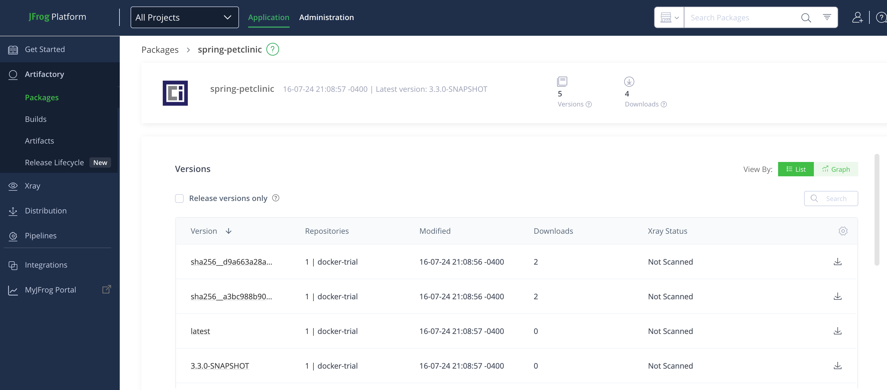

# Continuous integration - Spring PetClinic Sample Application 

Workflow `CI - Container image build` will be triggered whenever there's push or pull request merge to `main` branch. The workflow can also be triggered manually from the [workflow](https://github.com/kathywan/spring-petclinic-w-pipeline/actions/workflows/container-ci.yml) by clicking `Run workflow` button.

## Github Action workflow `CI - Container image build`
This workflow performs the following steps to build the application into a container image
1. use Gradle to compile and run unit tests
2. log into artifactory docker registry
3. Build docker image using the [Dockerfile](../../Dockerfile) which uses BUILD stage to build then package the executable jar into a runnable image. The image is then pushed to artifactory registry for distribution.

An example build output can be found [here](https://github.com/kathywan/spring-petclinic-w-pipeline/actions/runs/9966413619/job/27538441627)

And the container image was pushed to artifactory 
